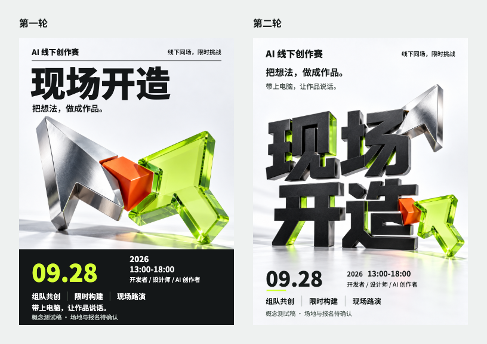
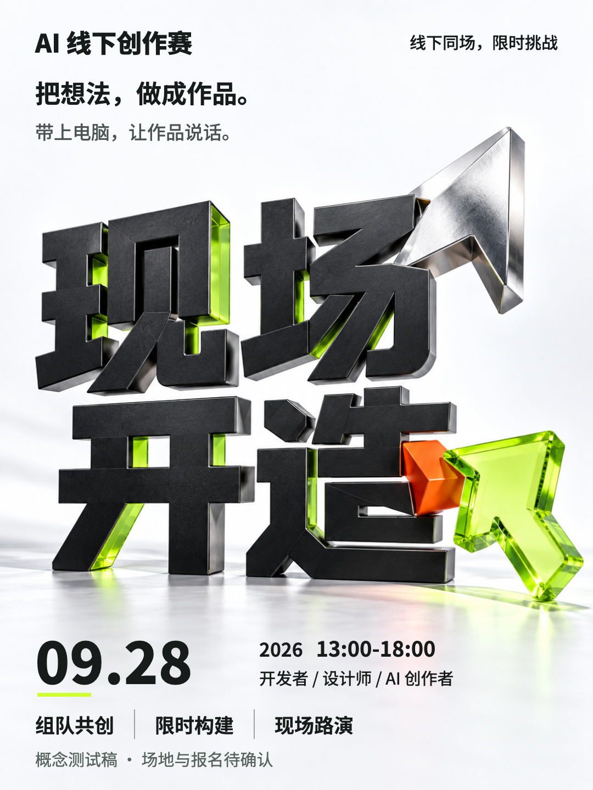

# 现场开造 / Build On Site

[中文首页](../../README.md) · [English overview](../../README.en.md)

**AI 线下创作赛 · Concept / Awaiting confirmation**

这是一次实际案例验证的展示记录，不是真实活动公告，也不是已获批准的商用发布稿。

This is a record of an actual case test, not a real event announcement or an approved commercial release.

## 起点 / Brief

用户给出的方向是“9 月 28 日的 AI 线下比赛”，其余创作内容由 Agent 提出。两轮固定同一主题、13 条文案、1080 × 1440 画布和 360 × 480 手机检查尺寸，保留光标与原型构建的视觉概念及黑、白、荧光绿、橙的配色。

The user supplied an offline AI competition on September 28. Both iterations retained the same subject, 13 copy strings, 1080 × 1440 canvas, 360 × 480 phone review, cursor/prototype idea, and black, white, lime, and orange palette.

年份、时间与赛制是测试设定；没有补造主办方、场地、奖金、报名链接或二维码。视觉确认与真实活动事实确认均未完成。

Year, time, and format are test assumptions. No organizer, venue, prize, registration link, or QR code was invented. Visual approval and real-world factual confirmation remain pending.

## 两轮对比 / Two Iterations

左侧是第一轮，右侧是第二轮。两张原始手机预览以相同尺寸并排呈现。

Round one is on the left; round two is on the right. The original phone previews are shown at equal size.

| 维度 / Dimension | 第一轮 / Round one | 第二轮 / Round two |
| --- | --- | --- |
| 标题 / Headline | 标题位于场景上方 / Headline above the scene | 字形成为被搭建的物件 / Lettering becomes the object being assembled |
| 图文关系 / Type and image | 光标与构件解释主题 / Cursors and components illustrate the theme | 光标接触与连接件参与字形表达 / Cursor contact and a joint contribute to the lettering |
| 构图 / Composition | 标题、场景、信息分区 / Separate title, scene, and information regions | 连续的明亮空间连接主要内容 / A continuous bright space connects the content |
| 编辑性 / Editability | 13 条文案均为 HTML 文本 / All 13 strings are HTML text | 标题为图像字形，其余 12 条仍可编辑 / Image headline; 12 strings remain editable |
| 取舍 / Trade-off | 日期对比更强 / Stronger date contrast | 标题整合更强，日期仍可读但视觉强调减弱 / More integrated headline; readable but less emphasized date |

第二轮仍然偏厚重、工业感，并不适合所有 brief。它验证了一次具体的创意整合，不代表通用的审美提升比例或所有 Agent 的表现。

The second iteration remains substantial and industrial, which will not suit every brief. This is one observed creative integration, not a general aesthetic improvement score or a comparison of agent performance.

## 第二轮 / Second Iteration

## 验证范围 / Verification Scope

| 项目 / Check | 本次记录 / Recorded result |
| --- | --- |
| 输出与内容 / Output and content | 1080 × 1440 PNG、非空画面、12 条 HTML 文案与 7 项关键事实绑定检查通过 / Exact-size nonblank PNG, 12 HTML strings, and seven critical fact bindings checked |
| 字形 / Lettering | 实际看图核对“现场开造”，不是从 alt 文本推断 / The actual image headline was read, not inferred from alt text |
| 视觉 / Visual review | 全尺寸、手机预览与同尺寸对比均已查看 / Full-size, phone, and equal-size comparison views inspected |
| 技术检查 / Technical checks | 本次 `inspect` 为 0 阻断、0 警告；13 项案例检查通过 / This run recorded zero blockers, zero warnings, and 13 passing case checks |
| 创意评价 / Creative judgment | 字体、构件和画面更紧密地表达“共同搭建”，同时保留上方列出的取舍 / Lettering, components, and scene more closely express shared making, with the trade-offs above |
| 阶段 / Stage | Concept，等待确认；严格最终交付检查按预期不通过 / Concept awaiting confirmation; strict final-delivery checks correctly did not pass |
| 生图 / Generation | 使用一次宿主原生生图调用；本页仅复用已有输出 / One native image attempt; this page reuses the existing output |

这些是该次测试的记录摘要，不是完整原始证据包。印刷可读性、二维码、真实活动事实、标题全编辑性、所有真实 Agent 的端到端创作均不在此次验证范围内。

These notes summarize that test; they are not the complete raw evidence package. Print readability, QR codes, real-world event facts, fully editable lettering, and end-to-end creation in every live agent were not verified.

## 展示文件来源 / Showcase Provenance

两张图片均从已有本地案例输出逐字节复制，未重新生成、裁切或修饰；展示副本不参与 Skill 安装与 Python wheel 打包。原始本地案例目录为 `artifacts/ai-offline-competition-2026-09-28-run-02/`，该目录按仓库规则不提交。

Both images are byte-for-byte copies of existing local case outputs, without regeneration, cropping, or retouching. They are excluded from Skill installs and Python wheels. The original local case directory is `artifacts/ai-offline-competition-2026-09-28-run-02/`, which remains untracked under the repository policy.

| 展示文件 / Showcase file | 原始文件 / Original file |
| --- | --- |
| [ai-competition-concept.png](../assets/ai-competition-concept.png) | `poster.png` |
| [ai-competition-comparison.png](../assets/ai-competition-comparison.png) | `reports/comparison.png` |

素材和模型输出保留各自适用条款，不以代码的 MIT 许可证代替素材权利审查。请勿将测试设定作为真实活动信息传播。

Assets and model outputs retain their applicable terms; the code's MIT license does not replace asset-rights review. Do not circulate the test assumptions as real event information.
